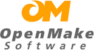

!SLIDE 
# Wireless #

* SSID: CustomInk-Guest
* Username: DevOpsDC
* Passcode: Password1

!SLIDE 
# DevOpsDC #

* 6:30 - 7:00
  * Meet, greet, and eat
* 7:00 - 7:15
  * Welcome, announcements, and introductions
* 7:15 - 8:45
  * Presentations

!SLIDE
# Sponsors - Thanks! #

OpenMake Software, theDevOps Authority, delivers a dynamic DevOps solution
for streamlining, standardizing and controlling the handoff of software
from Development Teams to IT Operations. Our solutions enable customers to
manage incremental software releases, leverage cloud environments, increase
developer productivity, eliminate manual bottlenecks, and provide
management with actionable traceability reports.

!SLIDE
# Sponsors - Thanks! #

