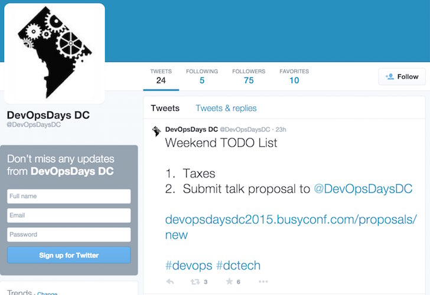

!SLIDE
# Follow @DevOpsDC #

!SLIDE
# Planning sessions

* Two weeks after each meetup via Google Hangout
* What do you see for 2015 & DevOpsDC?
* Tuesday, April 29 at 3:00 PM EDT
* RSVP on Meetup - space is very limited
* https://github.com/devopsdc/devopsdc

!SLIDE
# DevOpsDays DC #

* June 11 & 12
* USPTO in Arlington
* @devopsdaysdc
* organizers-washington-dc-2015@devopsdays.org
* http://devopsdays.org

!SLIDE
# Follow @DevOpsDaysDC #

!SLIDE
# DevOpsDays DC #

Call for presenters closes tomorrow!

!SLIDE

# Upcoming Conferences #

* RailsConf - Atlanta - April 21-23
  * Nathen Harvey will be presenting
* SATURN 2015 - Baltimore - April 27
* Jenkins User Conference - Alexandria - June 18

!SLIDE
# Upcoming Meetups #

* DC Python - share and learn - 4/18
* DC Tech - College Demos - 4/21
* DC Continuous Delivery - Docker: What, Why and How? - 4/22
* Docker DC - Docker Project's 2nd Birthday Celebration 4/23

!SLIDE
# More Upcoming Meetups #

* Ansible DC - Migrating To Ansible - 4/23
* Baltimore Puppet - Fun and Games with Beaker - 4/29
* Arlington Ruby - The Visual Design of Source Code - 4/29
* Polyglot Programming DC - Elixir and Haskell Typeclasses - 5/6

!SLIDE
# Upcoming Training #

* Chef Intermediate Topics - April 28-29
* Chef Fundamentals - April 30 - May 1

Discount Code:  MEETUP

!SLIDE
# Introductions & Announcements #

* Hiring?
* Looking for work?
* Attending or speaking at a conference?
* Something we all should know?

!SLIDE
# Next Meeting #

* May 19
* Full day workshop - Intro to Infrastructure Automation
* Open Spaces, Demos, and more

At Excella Consulting

!SLIDE
# Intro to Infrastructure Automation #

* Just enough Chef for DevOps
* Test-driven infrastructure
* Versioning and merging your infrastructure
* A devops release with Jenkins
* Free, enrollment capped at 12

!SLIDE
# Diversifying DevOps #

[!SiliconValley](../images/silicon-valley.jpg)
* Please, don't be the first to register if you see yourself here
