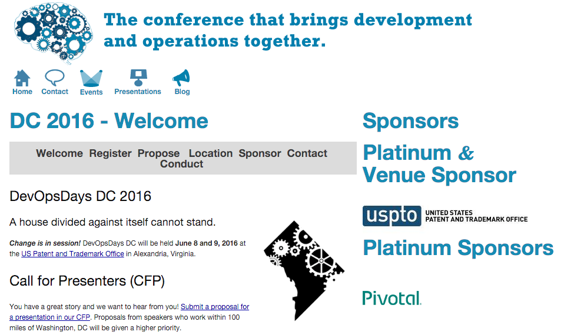
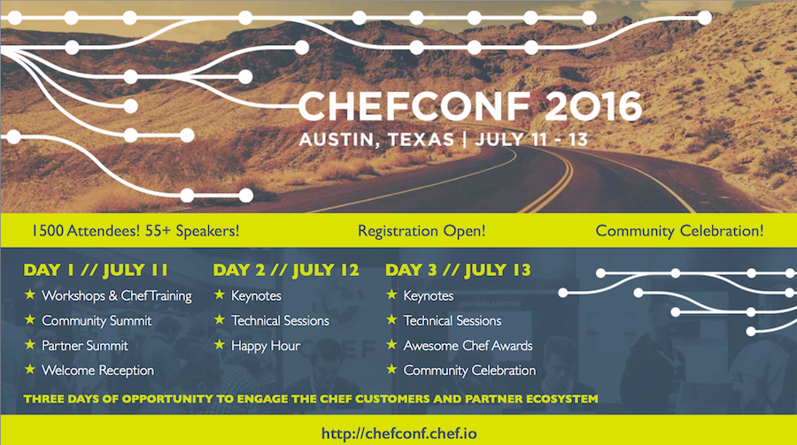
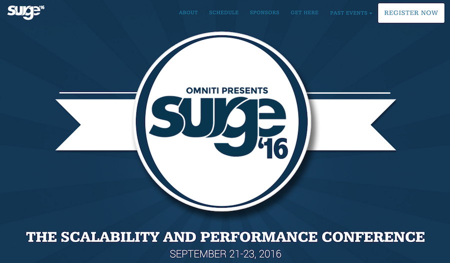

!SLIDE
# Code of Conduct #

[http://www.meetup.com/DevOpsDC/pages/Code\_of\_Conduct/](http://www.meetup.com/DevOpsDC/pages/Code_of_Conduct/)

We value the participation of each member of the community and want all attendees to have an enjoyable and fulfilling experience. Accordingly, all attendees are expected to show respect and courtesy to other attendees throughout all Meetup events.

To make clear what is expected, all delegates/attendees, speakers, exhibitors, organizers, and volunteers at any DevOpsDC event are required to conform to our Code of Conduct. Organizers will enforce this code throughout events.

!SLIDE
# Follow @DevOpsDC #

!SLIDE
# Slack!

http://www.dctechslack.com/

!SLIDE

# DevOpsDays DC #

!SLIDE

!SLIDE

!SLIDE

# June Meetup

* No June Meetup
* Come to DevOpsDays DC!
* Don't have a ticket?  Join the waitlist.

!SLIDE
# Introductions & Announcements #

* Hiring?
* Looking for work?
* Attending or speaking at a conference?
* Something we all should know?
