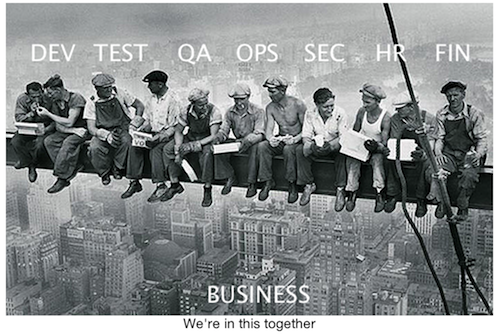

!SLIDE
# Follow @DevOpsDC #

!SLIDE
# DevOpsDays NYC

@devopsdays

http://devopsdays.org/

January 17-18, 2013

.notes Acela #2100 departs Union Station at 6:00AM

!SLIDE
# Monitorama

http://monitorama.com/

!SLIDE
# #ChefConf 2013

http://chefconf.opscode.com

Discount Code:  OPSCODE-MEETUP

CFP closes 15 February.  
Submit your talk tomorrow morning!

!SLIDE
# Moar Tech Conferences #

http://wiki.opscode.com/display/chef/Technical+Conferences

!SLIDE
# Food Fight! #

* The Podcast Where DevOps Chefs Do Battle
* http://foodfightshow.org
* http://bit.ly/ffsmail
* @FoodFightShow

!SLIDE
# Chef Introductory Workshop

* One-day intro workshop for Chef
* Next Tuesday, Jan 15 9:00-5:00
* MEETUP - saves you 10%
* Only 3 seats left

!SLIDE
# February Meetup #

* Tuesday, February 19
* At [TBD]
* Creating the Next Generation of Techies

Avleen Vig and Patrick McDonnell from Etsy and Ops School will be in town
for this joint-meetup to talk about Ops School and training sysadmins.
We'll have some additional talks, too.

!SLIDE
# Introductions & Announcements #

* Hiring?
* Looking for work?
* Attending or speaking at a conference?
* Something we all should know?
